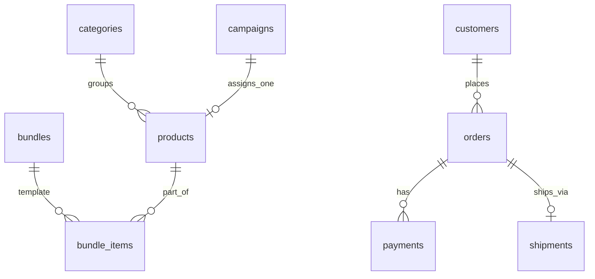

# Modelo de datos — De Tin Marín

> **Catálogo canónico.** Los briefs de etapa y el código **copian nombres de aquí**, nunca los recuerdan.

## Convenciones

- PK: `id uuid default gen_random_uuid()`
- Timestamps: `created_at`, `updated_at timestamptz`
- Soft-delete: `deleted_at timestamptz` en entidades editables
- Dinero: `numeric(12,2)` + `currency_code text default 'PEN'` (**solo soles peruanos**)
- RLS **habilitado** en toda tabla expuesta

## Schemas (v1)

```text
core       → staff, settings, audit
catalog    → products, bundles, categories
pricing    → campaigns (+ FK en products)
commerce   → orders, payments, shipments
crm        → customers

inventory  → ⏸ v2 (ledger de movimientos; v1 usa stock en products)
```

---

## Estructura de precios (JSONB)

Columna `catalog.products.prices` — **opción A (JSONB)**:

```json
{
  "normal": {
    "netPrice": 100.0,
    "igv": 18.0,
    "subtotal": 82.0
  },
  "suggested": {},
  "fantasy": {}
}
```

| Campo      | Significado                                |
| ---------- | ------------------------------------------ |
| `netPrice` | Precio final al cliente (**IGV incluido**) |
| `igv`      | Monto IGV incluido                         |
| `subtotal` | Base imponible (`netPrice - igv`)          |

v1 solo usa `normal`. Claves `suggested` y `fantasy` reservadas para futuro.

**Campaña activa:** el backend calcula precio final sobre `normal.netPrice` aplicando el `percentage` de la campaña asignada al producto.

---

## Catálogo de tablas

### Schema `core`

| Tabla             | Descripción                         |
| ----------------- | ----------------------------------- |
| `core.profiles`   | Perfil extendido de auth.users      |
| `core.user_roles` | Rol staff: `admin` \| `super_admin` |
| `core.settings`   | Configuración global key-value      |
| `core.audit_log`  | Auditoría de acciones sensibles     |

### Schema `catalog`

| Tabla                  | Descripción                       |
| ---------------------- | --------------------------------- |
| `catalog.categories`   | Categorías de productos (planas)  |
| `catalog.products`     | Dulce / producto individual       |
| `catalog.bundles`      | Plantilla de sorpresa (sin stock) |
| `catalog.bundle_items` | Composición base de la plantilla  |

**`catalog.categories`** (columnas clave):

| Columna               | Tipo        | Notas               |
| --------------------- | ----------- | ------------------- |
| `name`, `description` | text        |                     |
| `slug`                | text unique | URL amigable        |
| `is_active`           | boolean     |                     |
| `sort_order`          | int         | Orden visualización |
| `deleted_at`          | timestamptz | Soft-delete         |

**`catalog.products`** (columnas clave):

| Columna               | Tipo          | Notas                                |
| --------------------- | ------------- | ------------------------------------ |
| `sku`                 | text unique   | Obligatorio                          |
| `name`, `description` | text          |                                      |
| `slug`                | text unique   | URL amigable                         |
| `brand`               | text          | Marca (texto libre)                  |
| `image_url`           | text          | URL imagen principal (S1A)           |
| `prices`              | jsonb         | Ver estructura arriba                |
| `stock_quantity`      | int           | **Fuente de verdad v1**              |
| `category_id`         | uuid          | → `categories`                       |
| `campaign_id`         | uuid nullable | → `pricing.campaigns` (**1:1**, S1C) |
| `is_active`           | boolean       |                                      |
| `deleted_at`          | timestamptz   | Soft-delete                          |

**`catalog.bundles`** (plantilla — sin stock, sin precio persistido):

| Columna               | Tipo          | Notas                                                      |
| --------------------- | ------------- | ---------------------------------------------------------- |
| `name`, `description` | text          |                                                            |
| `image_url`           | text          | URL imagen principal (solo texto, sin Storage v1)          |
| `service_fee`         | numeric(12,2) | Fee de armado/servicio; **editable por bundle**            |
| `quantity`            | int           | Nº de personas/porciones a las que apunta el pack (`>= 1`) |
| `is_active`           | boolean       |                                                            |
| `deleted_at`          | timestamptz   |                                                            |

> **Sin columna `prices`.** El precio del bundle es **dinámico** (DECISIONS #6), calculado en cada consulta desde los componentes vivos:
>
> ```text
> total = service_fee + quantity × Σ (product.prices.normal.netPrice × units_per_person)
> ```

**`catalog.bundle_items`**: `bundle_id`, `product_id`, `units_per_person` (unidades de ese producto por persona/porción; **v1 fija en 1**). Unique `(bundle_id, product_id)`.

### Schema `pricing`

| Tabla               | Descripción         |
| ------------------- | ------------------- |
| `pricing.campaigns` | Campaña promocional |

**`pricing.campaigns`**:

| Columna       | Tipo         | Notas                               |
| ------------- | ------------ | ----------------------------------- |
| `name`        | text         |                                     |
| `description` | text         | Opcional                            |
| `percentage`  | numeric(5,2) | Descuento % sobre `normal.netPrice` |
| `starts_at`   | timestamptz  |                                     |
| `ends_at`     | timestamptz  |                                     |
| `is_active`   | boolean      | Kill switch                         |

**Relación producto ↔ campaña:** `catalog.products.campaign_id` (1:1). Un producto tiene **como máximo una** campaña asignada. Al asignar otra, se reemplaza. Si no hay campaña o expiró → precio = `prices.normal` sin descuento.

> v1 **no incluye:** `campaign_rules`, `coupons`, `price_rules`, `coupon_redemptions`.

### Schema `commerce`

| Tabla                | Descripción                               |
| -------------------- | ----------------------------------------- |
| `commerce.orders`    | Orden + **shopping_cart** JSONB congelado |
| `commerce.payments`  | Registro de pago (manual en v1)           |
| `commerce.shipments` | Envío                                     |

**`commerce.orders`**:

| Columna / grupo                                         | Notas                                                                    |
| ------------------------------------------------------- | ------------------------------------------------------------------------ |
| `order_number`                                          | Código legible (`TM-YYYYMMDD-NNNN`)                                      |
| `customer_id`                                           | → `crm.customers` nullable (guest v1)                                    |
| `contact`                                               | jsonb — snapshot `name`, `lastName`, `phone`, `email`                    |
| `fulfillment`                                           | jsonb — `method`, `deliveryAddress`, `notes`                             |
| `shopping_cart`                                         | jsonb — **Order shopping cart** congelado (ver [`orders.md`](orders.md)) |
| `payment_methods`                                       | jsonb — array flexible; detalle interno → S2C                            |
| `status`                                                | Ver [`orders.md`](orders.md)                                             |
| `payment_status`                                        | `pending` \| `confirmed` \| `refunded`                                   |
| `subtotal`, `discount_total`, `shipping_total`, `total` | Snapshots numéricos                                                      |
| `pricing_snapshot`                                      | jsonb — desglose al confirmar                                            |
| `currency_code`                                         | default `'PEN'`                                                          |
| `metadata`                                              | jsonb                                                                    |

**`commerce.payments`** (v1 manual):

| Columna        | Notas                                  |
| -------------- | -------------------------------------- |
| `order_id`     | FK                                     |
| `amount`       | numeric(12,2)                          |
| `status`       | `pending` \| `confirmed` \| `refunded` |
| `method`       | `internal` (v1)                        |
| `confirmed_by` | uuid staff que confirmó                |
| `notes`        | text                                   | Operador |
| `confirmed_at` | timestamptz                            |

Sin pasarela en v1 — sin `external_payment_id` obligatorio.

**`commerce.shipments`** (v1):

| Columna           | Tipo        | Notas                                 |
| ----------------- | ----------- | ------------------------------------- |
| `order_id`        | uuid unique | FK → `commerce.orders` (1:1)          |
| `status`          | text        | `pending` \| `shipped` \| `delivered` |
| `tracking_number` | text        | Opcional                              |
| `carrier`         | text        | Opcional                              |
| `shipped_at`      | timestamptz | Al marcar enviado                     |
| `delivered_at`    | timestamptz | Al marcar entregado                   |
| `notes`           | text        | Opcional                              |

Dirección de entrega: snapshot en `orders.fulfillment` — no duplicar en shipments.

### Schema `crm`

| Tabla                    | Descripción                       |
| ------------------------ | --------------------------------- |
| `crm.customers`          | Cliente (email, nombre, teléfono) |
| `crm.customer_addresses` | Direcciones de envío              |

> v1 **sin** `tier` VIP.

### Schema `inventory` (v2 — no implementar en v1)

Reservado para ledger `inventory_movements` y fuente de verdad desacoplada. v1 descuenta `products.stock_quantity` directamente (Regla 14).

---

## Diagrama ER (v1)



---

## RLS (postura resumida)

| Tabla                      | Lectura                       | Escritura                   |
| -------------------------- | ----------------------------- | --------------------------- |
| `catalog.products` activos | Público                       | Staff                       |
| `pricing.campaigns`        | Staff                         | Staff                       |
| `commerce.orders`          | Cliente propias / staff todas | Server + staff              |
| `commerce.payments`        | Staff                         | Staff (confirmación manual) |
| `commerce.shipments`       | Staff                         | Staff                       |

---

## Queries planificadas

| Query / RPC                                 | Uso                                                                  |
| ------------------------------------------- | -------------------------------------------------------------------- |
| `catalog.list_products_with_final_price()`  | Listado con campaña y `finalPrice` calculado en backend              |
| `commerce.deduct_stock_for_order(order_id)` | S2A — descuenta `products.stock_quantity` al confirmar pago (`paid`) |

---

## Fuera de v1

- Cupones, VIP, `price_rules`
- Pasarela de pagos / webhooks
- Schema `inventory` con movimientos
- Tipos de precio `suggested`, `fantasy` (estructura lista, sin lógica)
