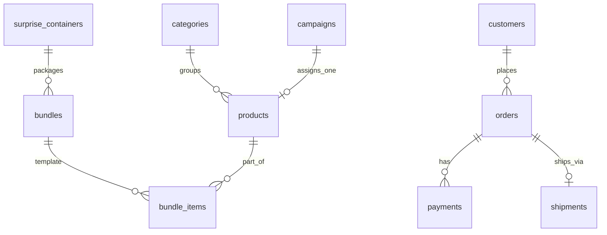

# Modelo de datos — De Tin Marín

> **Catálogo canónico.** Los briefs de etapa y el código **copian nombres de aquí**, nunca los recuerdan.

## Convenciones

- PK: `id uuid default gen_random_uuid()`
- Timestamps: `created_at`, `updated_at timestamptz`
- Soft-delete: `deleted_at timestamptz` en entidades editables
- Dinero: `numeric(12,2)` + `currency_code text default 'PEN'` (**solo soles peruanos**)
- RLS **habilitado** en toda tabla expuesta

## Schemas (v1)

```text
core       → staff, settings, audit
catalog    → products, bundles, categories, surprise_containers
pricing    → campaigns, delivery_zones, delivery_settings (+ FK en products)
commerce   → orders, payments, shipments
crm        → customers

inventory  → ⏸ v2 (ledger de movimientos; v1 usa stock en products)
```

---

## Estructura de precios (JSONB)

Columna `catalog.products.prices` — **opción A (JSONB)** (DECISIONS #13, #28):

```json
{
  "normal": {
    "netPrice": 6.0,
    "igv": 0.92,
    "subtotal": 5.08
  },
  "unit": {
    "netPrice": 0.6,
    "igv": 0.09,
    "subtotal": 0.51
  },
  "suggested": {},
  "fantasy": {}
}
```

| Clave / campo          | Significado                                                                                       |
| ---------------------- | ------------------------------------------------------------------------------------------------- |
| `normal`               | Precio de la **presentación** de compra (tira, paquete, caja) — IGV incluido en `netPrice`        |
| `unit`                 | Precio por **unidad base de consumo** (bolsa individual) — usado en bundles y costeo por sorpresa |
| `suggested`, `fantasy` | Reservadas — sin lógica v1                                                                        |

En cada bloque (`normal`, `unit`): `subtotal + igv = netPrice` (tolerancia centavos).

**Coherencia al guardar (Regla 2):**

```text
|unit.netPrice × items_per_package − normal.netPrice| ≤ 0.01
```

Si `items_per_package = 1`, `normal` y `unit` deben ser idénticos.

**Escritura:** el operador ingresa precio de presentación; el backend calcula `unit` vía `buildPricesFromPackageNetPrice`. No editar ambos bloques de forma independiente.

**Campaña activa:** descuento sobre `normal.netPrice`. Para bundles:

```text
finalUnitPrice = computeFinalPrice(normal.netPrice, campaign) / items_per_package
```

Listado catálogo (producto suelto): `finalPrice` sobre presentación (`normal`).

---

## Catálogo de tablas

### Schema `core`

| Tabla             | Descripción                         |
| ----------------- | ----------------------------------- |
| `core.profiles`   | Perfil extendido de auth.users      |
| `core.user_roles` | Rol staff: `admin` \| `super_admin` |
| `core.settings`   | Configuración global key-value      |
| `core.audit_log`  | Auditoría de acciones sensibles     |

### Schema `catalog`

| Tabla                         | Descripción                              |
| ----------------------------- | ---------------------------------------- |
| `catalog.categories`          | Categorías de productos (planas)         |
| `catalog.products`            | Dulce / producto individual              |
| `catalog.surprise_containers` | Insumo envase de sorpresa (S1E)          |
| `catalog.bundles`             | Plantilla de sorpresa (sin stock propio) |
| `catalog.bundle_items`        | Composición base de la plantilla         |

**`catalog.categories`** (columnas clave):

| Columna               | Tipo        | Notas               |
| --------------------- | ----------- | ------------------- |
| `name`, `description` | text        |                     |
| `slug`                | text unique | URL amigable        |
| `is_active`           | boolean     |                     |
| `sort_order`          | int         | Orden visualización |
| `deleted_at`          | timestamptz | Soft-delete         |

**`catalog.products`** (columnas clave):

| Columna                  | Tipo          | Notas                                                    |
| ------------------------ | ------------- | -------------------------------------------------------- |
| `sku`                    | text unique   | Obligatorio                                              |
| `name`, `description`    | text          |                                                          |
| `slug`                   | text unique   | URL amigable                                             |
| `brand`                  | text          | Marca (texto libre)                                      |
| `image_url`              | text          | URL imagen principal (S1A)                               |
| `product_type`           | text          | `'package'` \| `'unit'` — v1 casi todo `'unit'` (S1D)    |
| `items_per_package`      | int           | Unidades base por presentación (`>= 1`; default 1) (S1D) |
| `package_label`          | text nullable | Solo UX: `"tira"`, `"paquete"` (S1D)                     |
| `prices`                 | jsonb         | Ver estructura arriba (`normal` + `unit`)                |
| `stock_sealed_packages`  | int           | Paquetes/tiras **cerrados** (`>= 0`) (S1D)               |
| `stock_loose_base_units` | int           | Unidades base sueltas de paquetes abiertos (S1D)         |
| `category_id`            | uuid          | → `categories`                                           |
| `campaign_id`            | uuid nullable | → `pricing.campaigns` (**1:1**, S1C)                     |
| `is_active`              | boolean       |                                                          |
| `deleted_at`             | timestamptz   | Soft-delete                                              |

> **Stock total disponible:**
>
> ```text
> totalBaseUnits = stock_sealed_packages × items_per_package + stock_loose_base_units
> ```
>
> Normalizar tras cada movimiento: si `loose >= items_per_package`, convertir excedente a paquetes cerrados. Ver [inventory.md](inventory.md) y Regla 4.

> **`stock_quantity` (S1A):** deprecada — eliminada en migración S1D (`00008`). Backfill: `stock_loose_base_units = stock_quantity`, `stock_sealed_packages = 0`.

**`catalog.surprise_containers`** (insumo — S1E, **no** es producto vendible):

| Columna          | Tipo        | Notas                                              |
| ---------------- | ----------- | -------------------------------------------------- |
| `sku`            | text unique | Entre activos (`deleted_at IS NULL`)               |
| `name`           | text        | Ej. "Caja mediana", "Bolsa kraft"                  |
| `description`    | text        | Opcional                                           |
| `image_url`      | text        | URL texto (sin Storage v1)                         |
| `prices`         | jsonb       | Bloque único `{ netPrice, igv, subtotal }`         |
| `stock_quantity` | int         | `>= 0`; **1 envase = 1 unidad** (sin sealed/loose) |
| `is_active`      | boolean     |                                                    |
| `deleted_at`     | timestamptz | Soft-delete                                        |

> Sin `product_type`, `items_per_package`, `prices.unit`, campañas ni categorías. El precio entra al total de la sorpresa vía bundle/orden; no hay línea `type: "product"` en carrito.

**`catalog.bundles`** (plantilla — sin stock de dulces, sin precio persistido):

| Columna               | Tipo        | Notas                                                      |
| --------------------- | ----------- | ---------------------------------------------------------- |
| `name`, `description` | text        |                                                            |
| `image_url`           | text        | URL imagen principal (solo texto, sin Storage v1)          |
| `container_id`        | uuid        | FK → `catalog.surprise_containers` (S1E)                   |
| `quantity`            | int         | Nº de personas/porciones a las que apunta el pack (`>= 1`) |
| `is_active`           | boolean     |                                                            |
| `deleted_at`          | timestamptz |                                                            |

> ~~`service_fee`~~ eliminado en S1E (`00009`); reemplazado por envase referenciado.
>
> **Sin columna `prices`.** Precio **dinámico** (DECISIONS #6):
>
> ```text
> itemsSubtotalPerSorpresa = Σ (product.prices.unit.netPrice × units_per_person)
> total = quantity × (container.prices.netPrice + itemsSubtotalPerSorpresa)
> ```
>
> Con campaña activa en preview: usar `finalUnitPrice` por componente.

**`catalog.bundle_items`**: `bundle_id`, `product_id`, `units_per_person` (unidades **base** de ese producto por sorpresa/persona; **v1 fija en 1**). Unique `(bundle_id, product_id)`.

### Schema `pricing`

| Tabla                       | Descripción                        |
| --------------------------- | ---------------------------------- |
| `pricing.campaigns`         | Campaña promocional                |
| `pricing.delivery_zones`    | Tarifa delivery por distrito (S1E) |
| `pricing.delivery_settings` | Config global delivery (singleton) |

**`pricing.campaigns`**:

| Columna       | Tipo         | Notas                               |
| ------------- | ------------ | ----------------------------------- |
| `name`        | text         |                                     |
| `description` | text         | Opcional                            |
| `percentage`  | numeric(5,2) | Descuento % sobre `normal.netPrice` |
| `starts_at`   | timestamptz  |                                     |
| `ends_at`     | timestamptz  |                                     |
| `is_active`   | boolean      | Kill switch                         |

**Relación producto ↔ campaña:** `catalog.products.campaign_id` (1:1). Un producto tiene **como máximo una** campaña asignada. Al asignar otra, se reemplaza. Si no hay campaña o expiró → precio = `prices.normal` sin descuento.

> v1 **no incluye:** `campaign_rules`, `coupons`, `price_rules`, `coupon_redemptions`.

**`pricing.delivery_zones`** (S1E):

| Columna      | Tipo          | Notas                                    |
| ------------ | ------------- | ---------------------------------------- |
| `district`   | text unique   | Nombre distrito (match case-insensitive) |
| `fee`        | numeric(12,2) | Tarifa delivery `>= 0`                   |
| `is_active`  | boolean       |                                          |
| `sort_order` | int           | Orden en UI admin                        |

Seed inicial (Piura): Piura, Castilla, 26 de Octubre, La Unión, Catacaos — migración `00009`.

**`pricing.delivery_settings`** (singleton, `singleton_key = 'default'`):

| Columna            | Tipo          | Notas                         |
| ------------------ | ------------- | ----------------------------- |
| `pickup_enabled`   | boolean       | Recojo en tienda              |
| `delivery_enabled` | boolean       | Delivery habilitado           |
| `fallback_fee`     | numeric(12,2) | Tarifa si distrito no listado |

Resolución al crear orden: `pickup` → `shipping_total = 0`; `delivery` → fee de zona o `fallback_fee` (Regla 19).

### Schema `commerce`

| Tabla                | Descripción                               |
| -------------------- | ----------------------------------------- |
| `commerce.orders`    | Orden + **shopping_cart** JSONB congelado |
| `commerce.payments`  | Registro de pago (manual en v1)           |
| `commerce.shipments` | Envío                                     |

**`commerce.orders`**:

| Columna / grupo                                         | Notas                                                                    |
| ------------------------------------------------------- | ------------------------------------------------------------------------ |
| `order_number`                                          | Código legible (`TM-YYYYMMDD-NNNN`)                                      |
| `customer_id`                                           | → `crm.customers` nullable (guest v1)                                    |
| `contact`                                               | jsonb — snapshot `name`, `lastName`, `phone`, `email`                    |
| `fulfillment`                                           | jsonb — `method`, `deliveryAddress`, `notes`                             |
| `shopping_cart`                                         | jsonb — **Order shopping cart** congelado (ver [`orders.md`](orders.md)) |
| `payment_methods`                                       | jsonb — array flexible; detalle interno → S2C                            |
| `status`                                                | Ver [`orders.md`](orders.md)                                             |
| `payment_status`                                        | `pending` \| `confirmed` \| `refunded`                                   |
| `subtotal`, `discount_total`, `shipping_total`, `total` | Snapshots numéricos (`shipping_total` desde delivery zones en S1E)       |
| `pricing_snapshot`                                      | jsonb — desglose al confirmar                                            |
| `currency_code`                                         | default `'PEN'`                                                          |
| `metadata`                                              | jsonb                                                                    |

**`commerce.payments`** (v1 manual):

| Columna        | Notas                                  |
| -------------- | -------------------------------------- |
| `order_id`     | FK                                     |
| `amount`       | numeric(12,2)                          |
| `status`       | `pending` \| `confirmed` \| `refunded` |
| `method`       | `internal` (v1)                        |
| `confirmed_by` | uuid staff que confirmó                |
| `notes`        | text                                   | Operador |
| `confirmed_at` | timestamptz                            |

Sin pasarela en v1 — sin `external_payment_id` obligatorio.

**`commerce.shipments`** (v1):

| Columna           | Tipo        | Notas                                 |
| ----------------- | ----------- | ------------------------------------- |
| `order_id`        | uuid unique | FK → `commerce.orders` (1:1)          |
| `status`          | text        | `pending` \| `shipped` \| `delivered` |
| `tracking_number` | text        | Opcional                              |
| `carrier`         | text        | Opcional                              |
| `shipped_at`      | timestamptz | Al marcar enviado                     |
| `delivered_at`    | timestamptz | Al marcar entregado                   |
| `notes`           | text        | Opcional                              |

Dirección de entrega: snapshot en `orders.fulfillment` — no duplicar en shipments.

### Schema `crm`

| Tabla                    | Descripción                       |
| ------------------------ | --------------------------------- |
| `crm.customers`          | Cliente (email, nombre, teléfono) |
| `crm.customer_addresses` | Direcciones de envío              |

> v1 **sin** `tier` VIP.

### Schema `inventory` (v2 — no implementar en v1)

Reservado para ledger `inventory_movements` y fuente de verdad desacoplada. v1 descuenta:

- Productos: `stock_sealed_packages` + `stock_loose_base_units` (Regla 15, S2A)
- Envases: `surprise_containers.stock_quantity` (Regla 20, S2A)

---

## Diagrama ER (v1)



---

## RLS (postura resumida)

| Tabla                         | Lectura                       | Escritura                   |
| ----------------------------- | ----------------------------- | --------------------------- |
| `catalog.products` activos    | Público                       | Staff                       |
| `catalog.surprise_containers` | Público activos               | Staff                       |
| `pricing.campaigns`           | Staff                         | Staff                       |
| `pricing.delivery_zones`      | Público activos               | Staff                       |
| `pricing.delivery_settings`   | Público                       | Staff (update)              |
| `commerce.orders`             | Cliente propias / staff todas | Server + staff              |
| `commerce.payments`           | Staff                         | Staff (confirmación manual) |
| `commerce.shipments`          | Staff                         | Staff                       |

---

## Queries planificadas

| Query / RPC                                 | Uso                                                                        |
| ------------------------------------------- | -------------------------------------------------------------------------- |
| `catalog.list_products_with_final_price()`  | Listado con campaña y `finalPrice` calculado en backend                    |
| `commerce.deduct_stock_for_order(order_id)` | S2A — descuenta dulces (sealed/loose) + envases al confirmar pago (`paid`) |

---

## Fuera de v1

- Cupones, VIP, `price_rules`
- Pasarela de pagos / webhooks
- Schema `inventory` con movimientos
- Tipos de precio `suggested`, `fantasy` (estructura lista, sin lógica)
