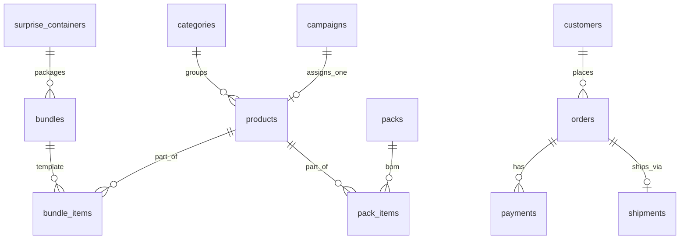

# Modelo de datos — De Tin Marín

> **Catálogo canónico.** Los briefs de etapa y el código **copian nombres de aquí**, nunca los recuerdan.

## Convenciones

- PK: `id uuid default gen_random_uuid()`
- Timestamps: `created_at`, `updated_at timestamptz`
- Soft-delete: `deleted_at timestamptz` en entidades editables
- Dinero: `numeric(12,2)` + `currency_code text default 'PEN'` (**solo soles peruanos**)
- RLS **habilitado** en toda tabla expuesta

## Schemas (v1)

```text
core       → staff, settings, audit
catalog    → products, bundles, categories, surprise_containers, packs
pricing    → campaigns, delivery_zones, delivery_settings (+ FK en products)
commerce   → orders, payments, shipments
crm        → customers

inventory  → ⏸ v2 (ledger de movimientos; v1 usa stock en products)
```

---

## Estructura de precios (JSONB)

Columna `catalog.products.prices` — **opción A (JSONB)** (DECISIONS #13, #28):

```json
{
  "normal": {
    "netPrice": 6.0,
    "igv": 0.92,
    "subtotal": 5.08
  },
  "unit": {
    "netPrice": 0.6,
    "igv": 0.09,
    "subtotal": 0.51
  },
  "suggested": {},
  "fantasy": {}
}
```

| Clave / campo          | Significado                                                                                       |
| ---------------------- | ------------------------------------------------------------------------------------------------- |
| `normal`               | Precio de la **presentación** de compra (tira, paquete, caja) — IGV incluido en `netPrice`        |
| `unit`                 | Precio por **unidad base de consumo** (bolsa individual) — usado en bundles y costeo por sorpresa |
| `suggested`, `fantasy` | Reservadas — sin lógica v1                                                                        |

En cada bloque (`normal`, `unit`): `subtotal + igv = netPrice` (tolerancia centavos).

**Coherencia al guardar (Regla 2):**

```text
|unit.netPrice × items_per_package − normal.netPrice| ≤ 0.01
  OR unit.netPrice × items_per_package > normal.netPrice   // ceil al derivar unit
```

`buildPricesFromPackageNetPrice` redondea `unit` **hacia arriba** (2 decimales) para que vender por unidad no sea más barato que el paquete.

Si `items_per_package = 1`, `normal` y `unit` deben ser idénticos.

**Escritura:** el operador ingresa precio de presentación; el backend calcula `unit` vía `buildPricesFromPackageNetPrice`. No editar ambos bloques de forma independiente.

**Campaña activa:** descuento sobre `normal.netPrice`. Para bundles:

```text
finalUnitPrice = computeFinalPrice(normal.netPrice, campaign) / items_per_package
```

Listado catálogo (producto suelto): `finalPrice` sobre presentación (`normal`).

---

## Catálogo de tablas

### Schema `core`

| Tabla                           | Descripción                                         |
| ------------------------------- | --------------------------------------------------- |
| `core.profiles`                 | Perfil extendido de auth.users                      |
| `core.user_roles`               | Rol staff: `admin` \| `super_admin`                 |
| `core.settings`                 | Configuración global key-value                      |
| `core.audit_log`                | Auditoría de acciones sensibles                     |
| `core.hero_settings`            | Singleton modo hero home (`static` \| `carousel`)   |
| `core.hero_images`              | Slides del hero (URL, orden, vigencia)              |
| `core.public_business_settings` | Singleton contacto + instrucciones de pago públicas |

**`core.hero_settings`** (singleton, `singleton_key = 'default'`):

| Columna         | Tipo        | Notas                                     |
| --------------- | ----------- | ----------------------------------------- |
| `singleton_key` | text unique | Solo `'default'`                          |
| `display_mode`  | text        | `static` \| `carousel` (default `static`) |
| `updated_at`    | timestamptz |                                           |

**`core.hero_images`** (columnas clave):

| Columna      | Tipo        | Notas                                       |
| ------------ | ----------- | ------------------------------------------- |
| `image_url`  | text        | URL CloudFront                              |
| `alt_text`   | text        | Nullable; ecommerce usa i18n si vacío       |
| `sort_order` | int         | Orden visualización                         |
| `starts_at`  | timestamptz | Inicio vigencia                             |
| `ends_at`    | timestamptz | Fin vigencia; `CHECK (ends_at > starts_at)` |
| `deleted_at` | timestamptz | Soft-delete                                 |

Vigencia (`now()` entre `starts_at` y `ends_at`) se filtra en **service de app**, no solo en RLS. Imágenes hero: **aspecto cuadrado 1:1** (±2 %), lado ≥ 600 px (validación admin). Folder S3: `hero/`.

**`core.public_business_settings`** (singleton, `singleton_key = 'default'`;
migración `00026_public_business_settings.sql`):

| Columna                         | Tipo        | Notas                               |
| ------------------------------- | ----------- | ----------------------------------- |
| `id`                            | uuid        | PK                                  |
| `singleton_key`                 | text unique | Solo `'default'`                    |
| `whatsapp_e164`                 | text        | E.164 sin `+` (ej. `51980966238`)   |
| `email`                         | text        | Correo de contacto público          |
| `yape_phone`                    | text        | Móvil Yape `9XXXXXXXX` (≠ WhatsApp) |
| `yape_holder_name`              | text        | Titular Yape                        |
| `bank_name`                     | text        | Banco (ej. BCP)                     |
| `bank_account_holder_name`      | text        | Titular de la cuenta                |
| `bank_account_number`           | text        | Número de cuenta (texto libre)      |
| `bank_interbank_account_number` | text        | CCI — 20 dígitos                    |
| `updated_at`                    | timestamptz |                                     |

Checks SQL: WhatsApp E.164 de 11–15 dígitos sin `+`, email con `@`, Yape
`9XXXXXXXX` y CCI de 20 dígitos. La capa Zod mantiene la misma semántica y
acota nombres, banco y cuenta.

**Acceso/RLS:** `SELECT` público (`anon`, `authenticated`) porque WhatsApp,
email e instrucciones de cobro se muestran en tienda. `UPDATE` solo
`core.is_staff()` y no hay policy de `INSERT`/`DELETE`: la migración crea la
única fila `singleton_key = 'default'`. No reutilizar `core.settings`
(key-value staff-only).

Es información **pública operativa**: no guardar secretos, tokens de pasarela
ni credenciales bancarias fuera de los datos que se muestran al cliente.

### Schema `catalog`

| Tabla                         | Descripción                              |
| ----------------------------- | ---------------------------------------- |
| `catalog.categories`          | Categorías de productos (planas)         |
| `catalog.products`            | Dulce / producto individual              |
| `catalog.surprise_containers` | Insumo envase de sorpresa (S1E)          |
| `catalog.bundles`             | Plantilla de sorpresa (sin stock propio) |
| `catalog.bundle_items`        | Composición base de la plantilla         |
| `catalog.packs`               | Combo vendible (sin stock propio)        |
| `catalog.pack_items`          | BOM fija: presentaciones + unidades base |
| `catalog.catalog_cache_meta`  | Singleton `version_at` (caché ecommerce) |

**`catalog.categories`** (columnas clave):

| Columna               | Tipo        | Notas               |
| --------------------- | ----------- | ------------------- |
| `name`, `description` | text        |                     |
| `slug`                | text unique | URL amigable        |
| `is_active`           | boolean     |                     |
| `sort_order`          | int         | Orden visualización |
| `deleted_at`          | timestamptz | Soft-delete         |

**`catalog.products`** (columnas clave):

| Columna                  | Tipo                   | Notas                                                                                   |
| ------------------------ | ---------------------- | --------------------------------------------------------------------------------------- |
| `sku`                    | text unique            | Obligatorio                                                                             |
| `name`, `description`    | text                   |                                                                                         |
| `slug`                   | text unique            | URL amigable                                                                            |
| `brand`                  | text                   | Marca (texto libre)                                                                     |
| `image_url`              | text                   | URL imagen principal (CDN CloudFront tras S0-03; texto libre)                           |
| `product_type`           | text                   | `'package'` \| `'unit'` — v1 casi todo `'unit'` (S1D)                                   |
| `items_per_package`      | int                    | Unidades base por presentación (`>= 1`; default 1) (S1D)                                |
| `package_label`          | text nullable          | Solo UX: `"tira"`, `"paquete"` (S1D)                                                    |
| `prices`                 | jsonb                  | Ver estructura arriba (`normal` + `unit`)                                               |
| `stock_sealed_packages`  | int                    | Paquetes/tiras **cerrados** (`>= 0`) (S1D)                                              |
| `stock_loose_base_units` | int                    | Unidades base sueltas de paquetes abiertos (S1D)                                        |
| `category_id`            | uuid                   | → `categories`                                                                          |
| `campaign_id`            | uuid nullable          | → `pricing.campaigns` (**1:1**, S1C)                                                    |
| `is_active`              | boolean                |                                                                                         |
| `purchase_min_quantity`  | int                    | Mín. presentaciones por pedido (default **10**) (DECISIONS #31)                         |
| `purchase_max_quantity`  | int                    | Máx. presentaciones por pedido (default **100**); acotado por stock                     |
| `cost_net_price`         | numeric(12,2) nullable | Costo proveedor (PEN; DECISIONS #36 / Regla 26). Margen/% derivados en app, no columnas |
| `deleted_at`             | timestamptz            | Soft-delete                                                                             |

> **Stock vendible (Regla 4 / DECISIONS #29):**
>
> ```text
> package → totalBaseUnits = sealed × items_per_package + loose
> unit    → available = stock_loose_base_units   # sealed no se abre ni vende
> ```
>
> Líneas `type: product` y componentes `type: pack` aportan **presentaciones**; componentes bundle aportan **unidad base**. Ver [inventory.md](inventory.md) y Reglas 15/24.

> **`stock_quantity` (S1A):** deprecada — eliminada en migración S1D (`00008`). Backfill: `stock_loose_base_units = stock_quantity`, `stock_sealed_packages = 0`.

**`catalog.surprise_containers`** (insumo — S1E, **no** es producto vendible):

| Columna          | Tipo        | Notas                                                |
| ---------------- | ----------- | ---------------------------------------------------- |
| `sku`            | text unique | Entre activos (`deleted_at IS NULL`)                 |
| `name`           | text        | Ej. "Caja mediana", "Bolsa kraft"                    |
| `description`    | text        | Opcional                                             |
| `image_url`      | text        | URL CDN / texto (upload admin S0-03 → `containers/`) |
| `prices`         | jsonb       | Bloque único `{ netPrice, igv, subtotal }`           |
| `stock_quantity` | int         | `>= 0`; **1 envase = 1 unidad** (sin sealed/loose)   |
| `is_active`      | boolean     |                                                      |
| `deleted_at`     | timestamptz | Soft-delete                                          |

> Sin `product_type`, `items_per_package`, `prices.unit`, campañas ni categorías. El precio entra al total de la sorpresa vía bundle/orden; no hay línea `type: "product"` en carrito.

**`catalog.bundles`** (plantilla — sin stock de dulces, sin precio persistido):

| Columna                      | Tipo        | Notas                                                                                        |
| ---------------------------- | ----------- | -------------------------------------------------------------------------------------------- |
| `name`, `description`        | text        |                                                                                              |
| `image_url`                  | text        | URL CDN / texto (upload admin S0-03 → `bundles/`)                                            |
| `container_id`               | uuid        | FK → `catalog.surprise_containers` (S1E)                                                     |
| `quantity`                   | int         | Cantidad de **sorpresas** de la plantilla (`>= 1`); default al personalizar                  |
| `customization_min_products` | int         | Mín. productos **distintos** al personalizar (default **8**; `not null`; migración `00025`)  |
| `customization_max_products` | int         | Máx. productos **distintos** al personalizar (default **20**; `not null`; techo app **100**) |
| `is_active`                  | boolean     |                                                                                              |
| `deleted_at`                 | timestamptz |                                                                                              |

> ~~`service_fee`~~ eliminado en S1E (`00009`); reemplazado por envase referenciado.
>
> `00025_bundle_customization_limits.sql` agrega ambas columnas, hace
> backfill de filas existentes a `8`/`20` y aplica checks
> `customization_min_products >= 1`,
> `customization_max_products >= 1` y `min <= max`. El límite superior de
> 100 se protege en Zod/app (`BUNDLE_CUSTOMIZATION_ABSOLUTE_MAX`), no con un
> `CHECK` de base de datos.
>
> **Sin columna `prices`.** Precio **dinámico** (DECISIONS #6):
>
> ```text
> itemsSubtotalPerSorpresa = Σ (product.prices.unit.netPrice × units_per_person)
> total = quantity × (container.prices.netPrice + itemsSubtotalPerSorpresa)
> ```
>
> Con campaña activa en preview: usar `finalUnitPrice` por componente.

**`catalog.bundle_items`**: `bundle_id`, `product_id`, `units_per_person` (unidades **base** de ese producto por sorpresa/persona; **v1 fija en 1**). Unique `(bundle_id, product_id)`.

**`catalog.packs`** (combo — sin stock propio; precio persistido):

| Columna                 | Tipo          | Notas                                                          |
| ----------------------- | ------------- | -------------------------------------------------------------- |
| `sku`                   | text unique   | Unique global (constraint `packs_sku_unique`)                  |
| `name`, `description`   | text          |                                                                |
| `slug`                  | text unique   | URL amigable                                                   |
| `image_url`             | text          | URL CDN / texto (upload admin S0-03 → `packs/`)                |
| `prices`                | jsonb         | `{ normal, reference }` cada uno `{ netPrice, igv, subtotal }` |
| `campaign_id`           | uuid nullable | → `pricing.campaigns` (**1:1**, DECISIONS #33)                 |
| `purchase_min_quantity` | int           | Default **1**                                                  |
| `purchase_max_quantity` | int           | Default **100**; `max >= min`                                  |
| `is_active`             | boolean       |                                                                |
| `deleted_at`            | timestamptz   | Soft-delete                                                    |

> **`reference`** = Σ (`product.prices.normal.netPrice × package_quantity` + `product.prices.unit.netPrice × unit_quantity`) (recalculada al guardar).
> **`normal`** = precio de venta del combo (admin). Invariante: `normal.netPrice >= reference.netPrice`.
> Campaña aplica sobre `normal` → `finalPrice` en listado/orden.
> Sin columnas de stock.

**`catalog.pack_items`**: `pack_id`, `product_id`, `package_quantity` (presentaciones; `>= 0`), `unit_quantity` (unidades base sueltas; `>= 0`). Invariante: `package_quantity + unit_quantity >= 1`. Unique `(pack_id, product_id)` — una fila por producto; ambas cantidades pueden ser > 0 a la vez. Solo productos (no packs anidados).

**`catalog.catalog_cache_meta`** (singleton — invalidación ecommerce, migraciones `00017`/`00018`):

| Columna         | Tipo        | Notas                                     |
| --------------- | ----------- | ----------------------------------------- |
| `singleton_key` | text unique | Siempre `'default'`                       |
| `version_at`    | timestamptz | Bump vía `catalog.bump_catalog_version()` |

> SELECT público. UPDATE/bump solo staff. El RPC hace `version_at = now()` + `realtime.send` (Broadcast público topic `catalog-version`, event `catalog_version_changed`). Fallo de broadcast no revierte el bump.

### Schema `pricing`

| Tabla                       | Descripción                        |
| --------------------------- | ---------------------------------- |
| `pricing.campaigns`         | Campaña promocional                |
| `pricing.delivery_zones`    | Tarifa delivery por distrito (S1E) |
| `pricing.delivery_settings` | Config global delivery (singleton) |

**`pricing.campaigns`**:

| Columna       | Tipo         | Notas                               |
| ------------- | ------------ | ----------------------------------- |
| `name`        | text         |                                     |
| `description` | text         | Opcional                            |
| `percentage`  | numeric(5,2) | Descuento % sobre `normal.netPrice` |
| `starts_at`   | timestamptz  |                                     |
| `ends_at`     | timestamptz  |                                     |
| `is_active`   | boolean      | Kill switch                         |

**Relación producto ↔ campaña:** `catalog.products.campaign_id` (1:1). Un producto tiene **como máximo una** campaña asignada. Al asignar otra, se reemplaza. Si no hay campaña o expiró → precio = `prices.normal` sin descuento.

> v1 **no incluye:** `campaign_rules`, `coupons`, `price_rules`, `coupon_redemptions`.

**`pricing.delivery_zones`** (S1E):

| Columna      | Tipo          | Notas                                    |
| ------------ | ------------- | ---------------------------------------- |
| `district`   | text unique   | Nombre distrito (match case-insensitive) |
| `fee`        | numeric(12,2) | Tarifa delivery `>= 0`                   |
| `is_active`  | boolean       |                                          |
| `sort_order` | int           | Orden en UI admin                        |

Seed inicial (Piura): Piura, Castilla, 26 de Octubre, La Unión, Catacaos — migración `00009`.

**`pricing.delivery_settings`** (singleton, `singleton_key = 'default'`):

| Columna            | Tipo          | Notas                         |
| ------------------ | ------------- | ----------------------------- |
| `pickup_enabled`   | boolean       | Recojo en tienda              |
| `delivery_enabled` | boolean       | Delivery habilitado           |
| `fallback_fee`     | numeric(12,2) | Tarifa si distrito no listado |

Resolución al crear orden: `pickup` → `shipping_total = 0`; `delivery` → fee de zona o `fallback_fee` (Regla 19).

### Schema `commerce`

| Tabla                | Descripción                               |
| -------------------- | ----------------------------------------- |
| `commerce.orders`    | Orden + **shopping_cart** JSONB congelado |
| `commerce.payments`  | Registro de pago (manual en v1)           |
| `commerce.shipments` | Envío                                     |

**`commerce.orders`**:

| Columna / grupo                                                            | Notas                                                                                                                                                                                   |
| -------------------------------------------------------------------------- | --------------------------------------------------------------------------------------------------------------------------------------------------------------------------------------- |
| `order_number`                                                             | Código legible (`TM-YYYYMMDD-NNNN`)                                                                                                                                                     |
| `customer_id`                                                              | → `crm.customers` nullable (guest v1)                                                                                                                                                   |
| `contact`                                                                  | jsonb — snapshot `name`, `lastName`, `phone`, `email`                                                                                                                                   |
| `fulfillment`                                                              | jsonb — `method`, `deliveryAddress`, `notes`                                                                                                                                            |
| `shopping_cart`                                                            | jsonb — **Order shopping cart** congelado (ver [`orders.md`](orders.md)): product dual `packageQuantity`/`unitQuantity`; pack BOM; bundle components. Migración dual histórica: `00024` |
| `payment_methods`                                                          | jsonb — array flexible; detalle interno → S2C                                                                                                                                           |
| `status`                                                                   | Ver [`orders.md`](orders.md)                                                                                                                                                            |
| `payment_status`                                                           | `pending` \| `confirmed` \| `refunded`                                                                                                                                                  |
| `subtotal`, `discount_total`, `surcharge_total`, `shipping_total`, `total` | Snapshots: `total = subtotal − discount + shipping + surcharge` (`00023`; surcharge admin-only)                                                                                         |
| `pricing_snapshot`                                                         | jsonb — desglose al confirmar                                                                                                                                                           |
| `currency_code`                                                            | default `'PEN'`                                                                                                                                                                         |
| `metadata`                                                                 | jsonb                                                                                                                                                                                   |

**`commerce.payments`** (v1 manual):

| Columna        | Notas                                  |
| -------------- | -------------------------------------- |
| `order_id`     | FK                                     |
| `amount`       | numeric(12,2)                          |
| `status`       | `pending` \| `confirmed` \| `refunded` |
| `method`       | `internal` (v1)                        |
| `confirmed_by` | uuid staff que confirmó                |
| `notes`        | text                                   | Operador |
| `confirmed_at` | timestamptz                            |

Sin pasarela en v1 — sin `external_payment_id` obligatorio.

**`commerce.shipments`** (v1):

| Columna           | Tipo        | Notas                                 |
| ----------------- | ----------- | ------------------------------------- |
| `order_id`        | uuid unique | FK → `commerce.orders` (1:1)          |
| `status`          | text        | `pending` \| `shipped` \| `delivered` |
| `tracking_number` | text        | Opcional                              |
| `carrier`         | text        | Opcional                              |
| `shipped_at`      | timestamptz | Al marcar enviado                     |
| `delivered_at`    | timestamptz | Al marcar entregado                   |
| `notes`           | text        | Opcional                              |

Dirección de entrega: snapshot en `orders.fulfillment` — no duplicar en shipments.

### Schema `crm`

| Tabla                    | Descripción                       |
| ------------------------ | --------------------------------- |
| `crm.customers`          | Cliente (email, nombre, teléfono) |
| `crm.customer_addresses` | Direcciones de envío              |

> v1 **sin** `tier` VIP.

### Schema `inventory` (v2 — no implementar en v1)

Reservado para ledger `inventory_movements` y fuente de verdad desacoplada. v1 descuenta:

- Productos: según `product_type` — `unit` solo loose; `package` sealed+loose (Regla 15, S2A; fix `00014`)
- Envases: `surprise_containers.stock_quantity` (Regla 20, S2A)

---

## Diagrama ER (v1)


```mermaid
erDiagram
  categories ||--o{ products : groups
  campaigns ||--o| products : assigns_one
  surprise_containers ||--o{ bundles : packages
  bundles ||--o{ bundle_items : template
  products ||--o{ bundle_items : part_of
  packs ||--o{ pack_items : bom
  products ||--o{ pack_items : part_of
  customers ||--o{ orders : places
  orders ||--o{ payments : has
  orders ||--o| shipments : ships_via
```

---

## RLS (postura resumida)

| Tabla                           | Lectura                       | Escritura                   |
| ------------------------------- | ----------------------------- | --------------------------- |
| `catalog.products` activos      | Público                       | Staff                       |
| `catalog.surprise_containers`   | Público activos               | Staff                       |
| `catalog.packs` / `pack_items`  | Público activos               | Staff                       |
| `pricing.campaigns`             | Público (SELECT)              | Staff                       |
| `pricing.delivery_zones`        | Público activos               | Staff                       |
| `pricing.delivery_settings`     | Público                       | Staff (update)              |
| `core.hero_settings`            | Público                       | Staff (update)              |
| `core.public_business_settings` | Público                       | Staff (update)              |
| `core.hero_images`              | Público (no deleted)          | Staff                       |
| `catalog.catalog_cache_meta`    | Público                       | Staff (update / bump RPC)   |
| `commerce.orders`               | Cliente propias / staff todas | Server + staff              |
| `commerce.payments`             | Staff                         | Staff (confirmación manual) |
| `commerce.shipments`            | Staff                         | Staff                       |

---

## Queries planificadas

| Query / RPC                                 | Uso                                                                                                 |
| ------------------------------------------- | --------------------------------------------------------------------------------------------------- |
| `catalog.list_products_with_final_price()`  | Listado con campaña y `finalPrice` calculado en backend                                             |
| `catalog.list_public_bundles(...)`          | S3A-1-R — page/sort/count público de sorpresas (`list_total` alineado a `computeBundleTotal`)       |
| `catalog.list_public_packs(...)`            | S3A-1-R — page/sort/count público de packs (`finalPrice` con campaña activa)                        |
| `catalog.bump_catalog_version()`            | Staff — `version_at = now()` + Broadcast Realtime `catalog-version`                                 |
| `commerce.deduct_stock_for_order(order_id)` | S2A (+ `00016`) — dulces por `product_type` + componentes pack (presentaciones) + envases al `paid` |

---

## Fuera de v1

- Cupones, VIP, `price_rules`
- Pasarela de pagos / webhooks
- Schema `inventory` con movimientos
- Tipos de precio `suggested`, `fantasy` (estructura lista, sin lógica)
